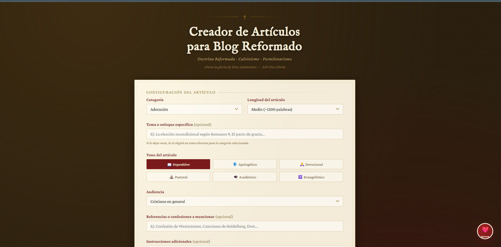
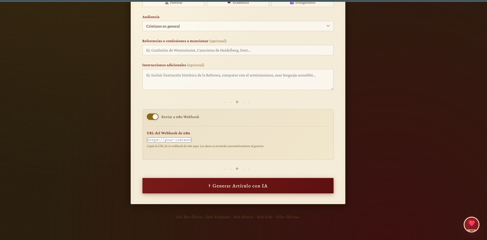
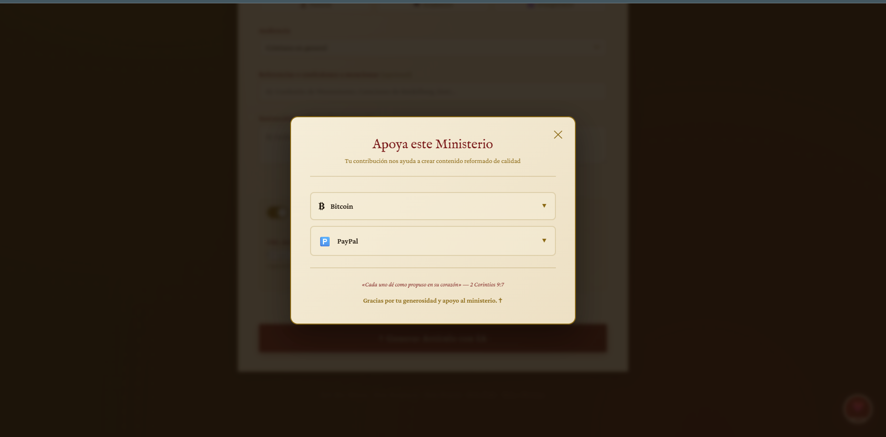

# � Creador de Artículos Teológicos Reformados

> **Generador automático de contenido bíblico con IA** - Artículos doctrinales, devocionales y apologéticos con imágenes generadas automáticamente usando OpenAI GPT-4 Turbo + DALL-E 3.

[](https://github.com/Adriel93/Creador-de-Articulos-Teologicos-Reformados)
[](LICENSE)
[](https://nodejs.org/)
[](https://openai.com/)

## ✨ Características Principales

### 🤖 Generación con IA Avanzada
- **GPT-4 Turbo**: Modelos de lenguaje más avanzados para contenido teológico preciso
- **DALL-E 3**: Generación automática de imágenes ilustrativas para cada artículo
- **Contenido Reformado**: Enfoque en teología bíblica y doctrina reformada

### 📝 Tipos de Artículos
- **Doctrinales**: Explicación profunda de doctrinas bíblicas
- **Devocionales**: Reflexiones espirituales para crecimiento personal
- **Apologéticos**: Defensa de la fe cristiana con argumentos racionales
- **Pastorales**: Guía práctica para líderes de iglesia

### 🎨 Interfaz Moderna
- **Diseño Reformado**: Estética clásica con elementos dorados y pergamino
- **Responsive**: Funciona perfectamente en desktop, tablet y móvil
- **Accesible**: Navegación intuitiva y experiencia de usuario fluida

### 💰 Sistema de Donaciones
- **Botón Flotante**: Acceso fácil desde cualquier página
- **Métodos Múltiples**: Bitcoin y PayPal con QR codes
- **Interfaz Elegante**: Modal moderno con animaciones suaves

## 🚀 Inicio Rápido

### 1. Clona el Repositorio
```bash
git clone https://github.com/Adriel93/Creador-de-Articulos-Teologicos-Reformados.git
cd creador-articulos-teologicos-reformados
```

### 2. Instala Dependencias
```bash
npm install
```

### 3. Configura tu API Key de OpenAI
```bash
# Crea un archivo .env.local
cp .env.example .env.local

# Edita .env.local y agrega tu API key:
OPENAI_API_KEY=sk-proj-tu-clave-aqui
```

### 4. Ejecuta el Servidor
```bash
npm start
```

### 5. Abre en tu Navegador
```
http://localhost:3000
```

¡Listo! Tu generador de artículos está funcionando.

## 📖 Cómo Usar

### Generar un Artículo

1. **Selecciona Categoría**: Doctrina, Apologética, Devocional, Pastoral
2. **Elige Tema**: Selecciona el tema específico dentro de la categoría
3. **Configura Tono**: Expositivo, exhortativo, didáctico, polémico
4. **Define Audiencia**: General, creyente nuevo, estudiante, pastor
5. **Establece Longitud**: Corta, media, larga
6. **Haz Click en "Generar Artículo"**

### Resultados
- **Artículo Completo**: Contenido teológico bien estructurado
- **Imagen Ilustrativa**: Generada automáticamente con DALL-E 3
- **Vista Previa**: Tabs para ver artículo, imagen y JSON
- **Copiar al Portapapeles**: Un click para copiar el contenido

## 💝 Apoyar este Ministerio

Si esta herramienta ha sido de bendición para tu ministerio o estudio bíblico, puedes apoyar este proyecto:

### Métodos de Donación
- **Bitcoin** 🪙 - Transacciones descentralizadas y seguras
- **PayPal** 💳 - Transferencias directas y tradicionales

### Cómo Donar

Haz click en el botón **❤️ Apoyar** en la esquina inferior derecha:



Se abrirá el panel de donaciones:



**Sistema de Donaciones Completo:**


Tu contribución nos ayuda a crear más contenido reformado de calidad y mantener este ministerio digital.

**Gracias. Soli Deo Gloria ✝️**

## 🏗️ Arquitectura

### Backend (Node.js + Express)
- **API Endpoints**: Generación de artículos y configuración
- **Validación**: Sanitización de inputs y validación de datos
- **Seguridad**: API keys protegidas, rate limiting
- **Webhook**: Integración con n8n/Zapier para automatización

### Frontend (Vanilla JavaScript)
- **Interfaz Moderna**: HTML5, CSS3, JavaScript ES6+
- **Responsive Design**: Mobile-first approach
- **Accesibilidad**: Navegación por teclado y lectores de pantalla

### Deployment
- **Vercel**: Serverless deployment con auto-scaling
- **CDN**: Archivos estáticos servidos globalmente
- **SSL**: HTTPS automático en todos los dominios

## 🔧 Configuración Avanzada

### Variables de Entorno
```env
# API de OpenAI
OPENAI_API_KEY=sk-proj-tu-clave-aqui
OPENAI_MODEL=gpt-4-turbo
OPENAI_IMAGE_MODEL=dall-e-3

# Configuración de Imágenes
IMAGE_QUALITY=hd
IMAGE_SIZE=1024x1024
IMAGE_STYLE=natural

# Servidor
PORT=3000
NODE_ENV=production

# Webhook
WEBHOOK_SECRET=tu-secreto-super-seguro
```

### Modelos Disponibles
- **GPT-4 Turbo**: Mejor calidad, recomendado
- **GPT-4**: Máxima capacidad, más costoso
- **GPT-3.5 Turbo**: Económico, buena calidad

## 📊 API Endpoints

### POST `/api/generate`
Genera un artículo basado en parámetros.

**Request:**
```json
{
  "categoria": "doctrina",
  "tema": "soberania-divina",
  "tono": "expositivo",
  "audiencia": "general",
  "longitud": "medio"
}
```

**Response:**
```json
{
  "titulo": "La Soberanía de Dios en la Elección",
  "articulo": "Contenido completo...",
  "slug": "soberania-dios-eleccion",
  "imagen_url": "https://...",
  "metadatos": {
    "categoria": "doctrina",
    "palabras": 850,
    "tiempo_generacion": 23000
  }
}
```

### GET `/api/config`
Obtiene configuración disponible (categorías, tonos, etc.)

### POST `/api/webhook`
Endpoint para integración con n8n/Zapier.

## 🚀 Deployment

### Vercel (Recomendado)
1. **Conecta tu Repo**: Importa desde GitHub
2. **Variables de Entorno**: Configura `OPENAI_API_KEY`
3. **Deploy**: Vercel hace el resto automáticamente

### Otros Proveedores
Compatible con cualquier plataforma que soporte Node.js:
- Netlify
- Railway
- Render
- Heroku

## 🔒 Seguridad

- **API Keys Protegidas**: Nunca expuestas al frontend
- **Rate Limiting**: Prevención de abuso
- **Validación**: Sanitización de todos los inputs
- **HTTPS**: Encriptación en tránsito
- **CORS**: Control de acceso cross-origin

## 📚 Documentación

### Guías Disponibles
- **[📖 Guía de Instalación](documentacion/GUIA_INSTALACION.md)** - Setup completo paso a paso
- **[🏗️ Documentación Técnica](documentacion/DOCUMENTACION_TECNICA.md)** - Arquitectura y componentes
- **[🚀 Guía de Producción](documentacion/GUIA_PRODUCCION.md)** - Deployment y monitoreo
- **[🔗 Guía de Webhook](documentacion/GUIA_WEBHOOK.md)** - Integración con n8n
- **[💝 Sistema de Donaciones](DONACIONES_RESUMEN.md)** - Funcionalidades completas
- **[� Guía de Seguridad](documentacion/GUIA_SEGURIDAD.md)** - Mejores prácticas
- **[📚 Índice Completo](documentacion/INDICE_DOCUMENTACION.md)** - Todas las guías organizadas

## 🧪 Testing

### Tests Automatizados
```bash
npm test
```

### Tests Manuales
```bash
# Ejecutar ejemplos
npm run examples

# Verificar API
curl -X POST http://localhost:3000/api/generate \
  -H "Content-Type: application/json" \
  -d '{"categoria":"doctrina","tono":"expositivo","audiencia":"general","longitud":"medio"}'
```

## 🤝 Contribuir

### Cómo Contribuir
1. **Fork** el proyecto
2. **Crea** una rama para tu feature (`git checkout -b feature/nueva-funcionalidad`)
3. **Commit** tus cambios (`git commit -am 'Agrega nueva funcionalidad'`)
4. **Push** a la rama (`git push origin feature/nueva-funcionalidad`)
5. **Abre** un Pull Request

### Áreas de Contribución
- **Mejoras en la IA**: Prompts más precisos, nuevos tipos de contenido
- **UI/UX**: Interfaz más intuitiva, nuevos temas
- **Internacionalización**: Soporte para múltiples idiomas
- **Integraciones**: Nuevos webhooks, APIs externas
- **Documentación**: Guías más detalladas, tutoriales

## 📈 Costos

### Estimación por Artículo
- **Texto (GPT-4 Turbo)**: ~$0.03-0.05
- **Imagen (DALL-E 3)**: ~$0.04
- **Total**: ~$0.09 por artículo

### Ejemplos de Uso
- **100 artículos/mes**: ~$9
- **1000 artículos/mes**: ~$90
- **10000 artículos/mes**: ~$900

## 🐛 Reportar Problemas

Si encuentras un bug o tienes una sugerencia:

1. **Revisa** la [documentación](documentacion/)
2. **Busca** issues similares en GitHub
3. **Crea** un nuevo issue con:
   - Descripción clara del problema
   - Pasos para reproducirlo
   - Información de tu entorno (Node.js, navegador, etc.)
   - Screenshots si aplica

## 📄 Licencia

Este proyecto está bajo la **Licencia MIT**. Ver el archivo [LICENSE](LICENSE) para más detalles.

## 🙏 Reconocimientos

- **OpenAI**: Por proporcionar las APIs de GPT-4 y DALL-E 3
- **Vercel**: Por la plataforma de deployment
- **Comunidad Open Source**: Por las herramientas y bibliotecas utilizadas

## 📞 Contacto

- **Autor**: [Tu Nombre]
- **Email**: tu-email@ejemplo.com
- **GitHub**: [Adriel93](https://github.com/Adriel93)
- **Sitio Web**: [tu-sitio.com](https://tu-sitio.com)

---

## ✝️ Misión

> *Crear contenido teológico reformado accesible mediante el uso responsable de la inteligencia artificial, para edificar la iglesia y promover el estudio serio de la Palabra de Dios.*

**Soli Deo Gloria** - A Dios solo la gloria

---

**⭐ Si este proyecto te bendice, considera darle una estrella en GitHub y compartirlo con otros ministros y estudiantes de la Biblia.**

4. **Ejecutar servidor**
```bash
npm start
```

Abrir en navegador: `http://localhost:3000`

## 📡 API Endpoints

### POST /api/generate
Genera un artículo completo con imagen.

**Body:**
```json
{
  "categoria": "doctrina",
  "tema": "La soberanía de Dios (opcional)",
  "tono": "expositivo",
  "audiencia": "general",
  "longitud": "medio",
  "referencias": "Confesión de Westminster (opcional)",
  "instrucciones": "Incluir aplicación práctica (opcional)"
}
```

**Respuesta:**
```json
{
  "titulo": "La Soberanía Absoluta de Dios en la Historia",
  "slug": "la-soberania-absoluta-de-dios-en-la-historia",
  "extracto": "Resumen del artículo...",
  "articulo": "Cuerpo completo del artículo...",
  "prompt_imagen": "Prompt utilizado para generar la imagen...",
  "imagen_url": "https://oaidalleapiprodscus.blob.core.windows.net/...",
  "metadatos": {
    "categoria": "doctrina",
    "tono": "expositivo",
    "audiencia": "general",
    "longitud": "medio",
    "timestamp": "2026-03-30T12:00:00Z",
    "proveedor": "openai"
  }
}
```

### POST /api/webhook
Idéntico a `/api/generate` pero optimizado para webhooks externos.

**Headers opcionales:**
```
X-Webhook-Secret: tu-secreto-opcional
```

### GET /api/categories
Devuelve lista de categorías disponibles.

### GET /api/config
Devuelve configuración de opciones (tonos, audiencias, longitudes).

## 🔗 Integración con n8n

### Flujo Sugerido

```
[Webhook Trigger]
  ↓
[HTTP Request - POST /api/webhook]
  • Method: POST
  • URL: https://tu-dominio.vercel.app/api/webhook
  • Body: Datos del formulario
  ↓
[Set Vars - Parse Response]
  • titulo: $json.titulo
  • articulo: $json.articulo
  • prompt_imagen: $json.prompt_imagen
  ↓
[OpenAI - Generate Image]
  • Prompt: $json.prompt_imagen
  ↓
[WordPress - Create Post]
  • Title: $json.titulo
  • Content: $json.articulo
  • Featured Image: URL de la imagen generada
```

## 🌐 Deploy en Vercel

### 1. Preparar para Vercel
```bash
git add .
git commit -m "Inicial commit"
git push origin main
```

### 2. Conectar Vercel
- Ir a [vercel.com](https://vercel.com)
- Importar repositorio de GitHub
- Vercel detectará automáticamente que es Node.js

### 3. Configurar Variables de Entorno
En Vercel Settings → Environment Variables:
```
OPENAI_API_KEY = sk-proj-xxxxx
WEBHOOK_SECRET = tu-secreto-opcional
```

### 4. Deploy
```bash
vercel deploy --prod
```

Tu sitio estará disponible en: `https://tu-proyecto.vercel.app`

## 🎯 Categorías Disponibles

### Adoración y Vida Cristiana
- Adoración
- Devocionales
- Reflexiones
- Familia
- Ética
- Perseverancia de los Santos

### Doctrina y Teología
- Doctrina
- Doctrinas de la Gracia
- Predestinación
- Providencia de Dios
- Teología
- Teología Reformada

### Teología Sistemática
- Bibliología
- Teología Propia (Dios)
- Angelología
- Antropología
- Hamartiología (Pecado)
- Cristología
- Soteriología
- Pneumatología
- Eclesiología
- Escatología

### Historia e Iglesia
- Historia de la Iglesia
- La Reforma
- Misiones

### Estudio Bíblico
- Hermenéutica
- Catequesis
- Apologética
- Evangelio

## 🎨 Tonos Disponibles

- **📖 Expositivo**: Análisis profundo de textos bíblicos y doctrina
- **🛡️ Apologético**: Defensa de la fe reformada
- **🙏 Devocional**: Inspiración y reflexión personal
- **⛪ Pastoral**: Orientación para líderes y pastores
- **🎓 Académico**: Análisis riguroso y erudición
- **✝️ Evangelístico**: Presentación de la fe a no creyentes

## 👥 Audiencias

- Cristiano en general
- Nuevo creyente
- Buscador / No creyente
- Estudiante de teología
- Líder / Pastor

## 📏 Longitudes

- Corto (~600 palabras)
- Medio (~1200 palabras)
- Largo (~2000 palabras)
- Extenso (~3000 palabras)

## 🏗️ Estructura del Proyecto

```
proyecto-blog/
├── api/
│   └── index.js              # Servidor Express y endpoints
├── public/
│   ├── index.html            # Interfaz HTML
│   ├── css/
│   │   └── styles.css        # Estilos
│   └── js/
│       └── app.js            # Lógica del frontend
├── package.json
├── .env.example
├── .gitignore
├── vercel.json               # Configuración de Vercel
└── README.md
```

## 🛠️ Tecnologías

- **Backend**: Express.js, Node.js
- **Frontend**: HTML5, CSS3, JavaScript vanilla
- **IA**: OpenAI (GPT-4 Turbo para artículos + DALL-E 3 para imágenes)
- **Deploy**: Vercel
- **Diseño**: CSS personalizado (inspirado en estética reformada)

## 🔐 Seguridad

- Variables de entorno para claves API
- Validación de entrada en backend
- Webhook secret opcional
- CORS configurado
- Rate limiting recomendado en producción
- API key de OpenAI nunca expuesta al cliente
- Soporte para .env y .env.local (testing)

## 📝 Próximas Mejoras

- [ ] Autenticación de usuarios
- [ ] Base de datos de artículos generados
- [ ] Rate limiting
- [ ] Generación de imágenes integrada
- [ ] Integración directa con WordPress
- [ ] Caché de respuestas
- [ ] Análisis de uso

## 📜 Licencia

MIT

## 🙏 Soli Deo Gloria

*"Para la gloria de Dios solamente"*

Este proyecto está dedicado a la difusión de la teología reformada bíblica.

---

**Desarrollado con ✝️ en la verdad de las Escrituras**

Para soporte: [crear issue en GitHub]
